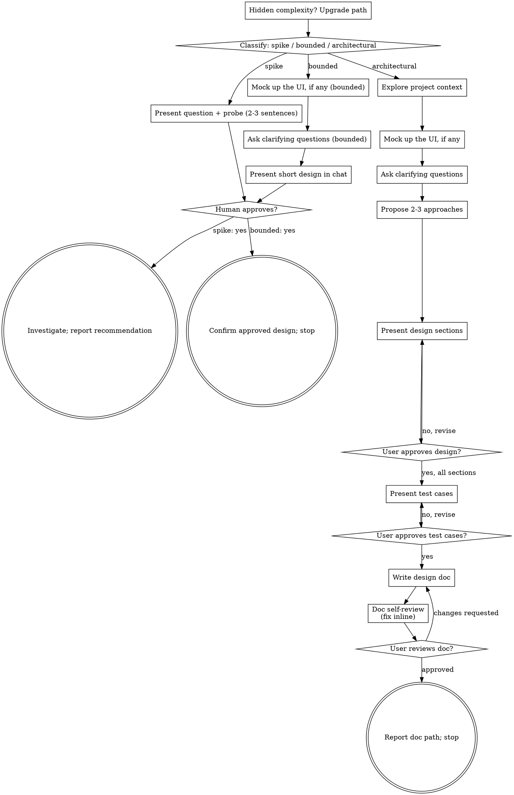
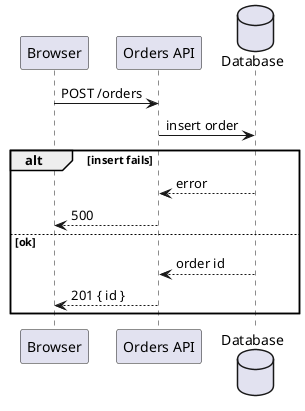

# Producing Designs

Help turn ideas into fully formed designs and specs through natural collaborative dialogue.

Start by classifying how much process the request needs, then work
through your path: understand the context, refine the idea, present a
design, and get your human partner's approval.

<HARD-GATE>
Do NOT invoke any implementation skill, write any code, scaffold any
project, or take any implementation action until you have told your
human partner what you intend and they have approved it. This applies
to EVERY task on EVERY path below — the ceremony scales with the task;
the approval gate never does. Approval ends this skill; it does not
start implementation (see Where produce-design ends).
</HARD-GATE>

## Three Paths

Before your first question, classify the request and say the
classification out loud — "this looks bounded, so I'll present a short
design here rather than write a spec" — so your human partner can
override it:

- **Spike** — a feasibility question ("can we...", "is it possible...",
  "quick and dirty is fine") whose output is an answer, not code you
  keep. Present the question and what you'll try in 2-3 sentences, get
  a nod, then find out as cheaply as correctness allows. No design
  doc, no spec file. Report findings as a recommendation; anything you
  built stays labeled throwaway.
- **Bounded** — a well-scoped change to code that already exists in
  this repo: a new flag, a small endpoint, a one-file fix.
  Understanding the kind of app is not enough — bounded means the flow
  you are changing is already here to read. If there is no existing
  flow to change, the task is not bounded. Ask the clarifying
  questions that matter, present a short design IN CHAT (a few
  sentences to a few short paragraphs), and STOP until your human
  partner says yes to it — a bounded task's approval is as hard a
  gate as an architectural one. No spec file.
- **Architectural** — new projects, new subsystems, changes that
  restructure how components fit together or alter interfaces others
  depend on. Follow the full process: questions, approaches, sectioned
  design, test cases, written design document.

When in doubt between two paths, take the heavier one. The ratchet is
one-way: hidden complexity discovered mid-task upgrades the path —
stop, say so, and step up. Nothing downgrades mid-task.

## Anti-Pattern: "Too Simple To Need Approval"

Every path ends with your human partner approving your intent before
implementation. A todo list, a single-function utility, a config
change — the design may be two sentences in chat, but you MUST present
it and get approval. "Simple" tasks are where unexamined assumptions
cause the most wasted work. What scales with simplicity is the
artifact, never the approval.

## Red Flags

| Thought | Reality |
|---------|---------|
| "This is too simple to need a design" | Simple means a short design, not no design. Two sentences in chat, then approval. |
| "I'll call it bounded and skip the spec" | Reaching for a label to skip work IS the doubt — take the heavier path. |
| "It's bounded and the design is obvious — I'll start while they read it" | The gate is the approval, not the design's length. Present, then stop until you hear yes. |
| "I understand this kind of app, so it's bounded" | Bounded measures the repo, not your familiarity. A new project has no existing flow — it is architectural. |
| "The spike works, so I'll keep the code" | A spike's output is an answer. Keeping the code is a new request — classify it. |
| "It grew, but I'm almost done — no need to re-classify" | Hidden complexity upgrades the path mid-task. Stop and say so. |
| "They approved the spike, so the follow-up change is approved too" | Each task gets its own classification and its own approval. |
| "They only changed one detail — the rest stands, so I'll move on" | A correction approves nothing. Give your position, re-present the section, ask for approval. |
| "They answered my question, so the section is settled" | An answer is feedback, not approval. Re-present the section and ask again. |
| "They said yes and originally asked me to build it, so I'll start" | The yes approves the design. Send the hand-off message; building is their next request. |
| "The UI part is small — I'll describe it in words" | Any UI part gets a mockup script. A small UI means a short script. |
| "I'll mock up the UI once the architecture is settled" | The mockup comes first: its flows tell you what the architecture must serve. |
| "I'll draw the mockup myself" | A designer agent draws it from your script; your human partner runs it. |
| "The design sections are approved, so I'll write the document" | Test cases come next, and they are an approval gate of their own. |
| "I'll leave this gap in the document for the builders to settle" | Builders work apart and would settle it differently. Ask your human partner now. |
| "A complete design shows every diagram type" | Each conditional section appears only when its condition holds (design-doc.md). |
## Checklist

Classify first, announce the path, then create a task for each item on
your path and complete them in order.

**Spike:**
1. **Explore project context** — enough to frame the probe
2. **Present question + probe plan** — 2-3 sentences
3. **Get approval** — a nod is enough
4. **Investigate** — as cheaply as correctness allows
5. **Report findings** — a recommendation; label anything built as throwaway

**Bounded:**
1. **Explore project context** — check files, docs, recent commits
2. **Mock up the UI** — if the change has a UI part: write the mockup script and get the mockup approved before any other design work (see UI mockups)
3. **Ask clarifying questions** — one at a time, the ones that matter
4. **Present short design in chat** — approach, files touched, testing; the approved mockup; a sequence diagram for any flow it changes (see Showing flows)
5. **Get approval** — STOP and wait for an explicit yes; presenting the design and starting in the same breath is skipping the gate
6. **Hand off** — send the hand-off message and stop (see Where produce-design ends)

**Architectural:**
1. **Explore project context** — check files, docs, recent commits
2. **Mock up the UI** — if the design has a UI part: write the mockup script and get the mockup approved before any other design work (see UI mockups)
3. **Ask clarifying questions** — one at a time, understand purpose/constraints/success criteria
4. **Propose 2-3 approaches** — with trade-offs and your recommendation
5. **Present design sections** — one per message, in order (see Design sections); each stays open until your human partner explicitly approves it (see Closing a section)
6. **Present test cases** — UAT, E2E and SIT, one line each, approved like a section (see test-cases.md)
7. **Write design doc** — save it to disk in the project's design-doc location and format (see After the Design)
8. **Doc self-review** — quick inline check (see below)
9. **User reviews written doc** — ask your human partner to review it; once approved, report its path and stop (see Where produce-design ends)

## Process Flow



**Where produce-design ends.** The skill's output is an approved
design; what happens next is your human partner's call.

- Spike: a reported recommendation.
- Bounded: after the yes, your whole message is:
  > "Design approved: <the design in one sentence>. Tell me when you want it implemented."
- Architectural: after the design doc is approved, your whole message is:
  > "Design doc approved: `<path or issue URL>`. When you want it built, I'll split it into builder plans with rux-skills:writing-builder-plans."

That holds even when the original request was "add X" or "build Y":
the yes approves the design, and building it is your human partner's
next request. Implementation starts when they ask for it.

## The Process

The subsections below serve the bounded and architectural paths (a
spike stops at "present the probe, get a nod"). Sections from
**Exploring approaches** onward are architectural-path depth — for
bounded work, context plus the mockup (if it has a UI part) plus a few
questions plus a short in-chat design is the whole process.

**Understanding the idea:**

- Check out the current project state first (files, docs, recent commits)
- Before asking detailed questions, assess scope: if the request describes multiple independent subsystems (e.g., "build a platform with chat, file storage, billing, and analytics"), flag this immediately. Don't spend questions refining details of a project that needs to be decomposed first.
- If the project is too large for a single spec, help the user decompose into sub-projects: what are the independent pieces, how do they relate, what order should they be built? Then design the first sub-project through the normal design flow. Each sub-project gets its own design and spec.
- For appropriately-scoped projects, ask questions one at a time to refine the idea
- Prefer multiple choice questions when possible, but open-ended is fine too
- Only one question per message - if a topic needs more exploration, break it into multiple questions
- Focus on understanding: purpose, constraints, success criteria

**UI mockups:**

A design has a UI part when it adds or changes something people see or
use on a screen: a page, dialog, form, list, panel, or component. When
it does, the mockup is the first thing you settle. It shows the user
flows, and the flows show what data, operations and infrastructure the
rest of the design must serve.

You do not draw the mockup. A designer agent (Claude Design, Stitch)
draws it from a script you write, and your human partner runs it.

1. Ask only what you need to know what the screens are for — one or two
   questions at most. Every other question waits for the mockup.
2. Send the script as one fenced block, followed by:
   > "Paste this into your designer agent (Claude Design, Stitch) and bring the mockup back."

   Then stop.
3. When the mockup comes back, review it with your human partner. It is
   an approval gate like a design section (see Closing a section);
   feedback means a revised script, sent whole, for them to run again.
4. Once it is approved, list the flows it shows and what each one needs
   — the data each screen shows, the operation behind each action.
   Those needs drive the remaining questions and the design.

The script contains, in order:

1. **Product context** — the app, who uses these screens, platform and
   viewport, and the existing look to match (design system, component
   library, the screen this sits in)
2. **Screens** — for each new or changed screen: its purpose, the
   content it shows with realistic sample data, and every action a
   person can take
3. **Flows** — each task a person does, step by step across the screens
4. **States** — empty, loading, error and validation states for each
   screen that has them
5. **Out of scope** — what the mockup must leave out

For a bounded change, the screens are only the changed ones, each named
with the existing screen it sits in.

**Exploring approaches:**

- Propose 2-3 different approaches with trade-offs
- Present options conversationally with your recommendation and reasoning
- Lead with your recommended option and explain why
- YAGNI ruthlessly - remove unnecessary features from every approach and design

**Presenting the design:**

- Once you believe you understand what you're building, present the design
- Scale each section to its complexity: a few sentences if straightforward, up to 200-300 words if nuanced
- Ask after each section whether it looks right so far
- Be ready to go back and clarify if something doesn't make sense

**Design sections (architectural path):**

Present these in order, one per message, each with its diagram.
design-doc.md says what each contains and how to draw it.

1. **Requirements and terms** — always
2. **Architecture** — always; component diagram
3. **Data model** — when stored data or shared types are added or changed; class diagram
4. **Flows** — always; one sequence diagram per flow (API, data and UI flows)
5. **States** — when an entity has a status whose transitions are restricted; state diagram
6. **Compatibility and migration** — when existing data, or an interface other code depends on, changes
7. **Error handling** — always
8. **Telemetry** — when the design crosses a service boundary, adds a background job, or has a failure path someone must diagnose in production

Skip a section whose condition does not hold. When a gap turns up —
something the design must decide but nobody has — ask your human partner
about it in the section where it belongs.

After the last section is approved, present the test cases (see
test-cases.md).

**Showing flows:**

When you describe a flow — requests, messages, or data passing in order between two or more participants (user, UI, services, workers, databases, external systems) — show it as a PlantUML sequence diagram:



- One diagram per flow. Cover the error or alternate path with `alt` when the section discusses it.
- Keep prose for what the diagram can't show: reasons, constraints, trade-offs.
- This holds wherever you describe a flow: design sections, approaches, the bounded path's short design, and the written design doc.

**Closing a section — only an approval closes it:**

Your human partner's reply to a section is either an approval or feedback.

- **Approval** says the section is fine as shown: "yes", "approved", "looks good", "LGTM", "next". Move on to the next section.
- **Feedback** is everything else: a correction, "ignore X", "use Y instead", "yes, but change Z", an answer to your question, a question, a remark on one detail. The section stays open — even when the feedback is small and seems to settle it.

When the reply is feedback, your next message has these parts, in order:

1. **Your position** — say you agree and why, in a sentence or two; or say you disagree or see a risk, and why. If the feedback is unclear, ask your one question here and end the message.
2. **The revised section, in full.**
3. **The approval question** — "Is section N approved?"

The next section does not appear in that message. When they answer your question, that answer is feedback too: send parts 1-3 again.

This applies to every approval gate in this skill: the mockup, each design section, the test cases, the bounded path's short design, and the written design doc.

**Design for isolation and clarity:**

- Break the system into smaller units that each have one clear purpose, communicate through well-defined interfaces, and can be understood and tested independently
- For each unit, you should be able to answer: what does it do, how do you use it, and what does it depend on?
- Can someone understand what a unit does without reading its internals? Can you change the internals without breaking consumers? If not, the boundaries need work.
- Smaller, well-bounded units are also easier for you to work with - you reason better about code you can hold in context at once, and your edits are more reliable when files are focused. When a file grows large, that's often a signal that it's doing too much.

**Working in existing codebases:**

- Explore the current structure before proposing changes. Follow existing patterns.
- Where existing code has problems that affect the work (e.g., a file that's grown too large, unclear boundaries, tangled responsibilities), include targeted improvements as part of the design - the way a good developer improves code they're working in.
- Don't propose unrelated refactoring. Stay focused on what serves the current goal.

## After the Design (architectural path)

**Documentation:**

Find where design docs go for this project:

1. Look for a design-doc location already recorded for this project: first your harness's persistent memory, then the project instruction file (`CLAUDE.md`, `AGENTS.md`, `GEMINI.md`).
2. If found, use it without asking.
3. If not found, ask your human partner where design docs go for this project: a folder, or GitHub issues in a repository.
4. Record the answer: in your harness's per-project memory if it has one; otherwise add a line to the project instruction file.

**Format.** When design docs go to GitHub issues, see GitHub issue
below. For a folder, look for a `.obsidian` folder in it or any folder
above it:

- **Found** — the folder is in an Obsidian vault. Write Obsidian
  Markdown (`.md`), following template-obsidian.md.
- **Not found** — write AsciiDoc (`.adoc`), following template.adoc.

Diagrams are PlantUML in both.

**GitHub issue.** GitHub does not render PlantUML, so an issue uses
Mermaid. Follow template-obsidian.md's sections in GitHub Markdown: draw
each diagram in a ` ```mermaid ` block (a component diagram becomes a
`flowchart`), and write comments as `<!-- -->`. Write the body to a file
in your scratchpad or temp directory; that file is what the self-review
and your human partner's review check. Once they approve it, create the
issue with `gh issue create --body-file <file>`. A split design becomes
one issue per part: create the parts first, then the master issue
linking them by number.

**File name** (folder docs). Every file name starts with today's date, `YYYY-MM-DD-`,
followed by a name you choose — for example
`2026-09-27-customer-tags-design.adoc` (`.md` in a vault). The date
prefix holds even when other files in the folder are named differently,
and for each part document of a split design. The extension comes from
the format.

Then:

- Write the approved design and save it to disk
- Use elements-of-style:writing-clearly-and-concisely skill if available

**What the doc contains.** The design doc is the approved design and
nothing more: the sections of design-doc.md, in its order — purpose and
scope, requirements and terms, approach, UI, each approved design
section, and the approved test cases. One document, unless design-doc.md's
splitting rule applies.

Existing documents in the folder do not shape this one. When they carry
other sections — implementation plan, unit tests,
verification, release or delivery, as built — this doc still holds only
the sections of design-doc.md.

**Doc Self-Review:**
After writing the design doc, look at it with fresh eyes:

1. **Placeholder scan:** Any "TBD", "TODO", incomplete sections, or vague requirements? Fix them.
2. **Internal consistency:** Do any sections contradict each other? Does the architecture match the feature descriptions?
3. **Scope check:** Is this focused enough to build as one piece, or does it need decomposition?
4. **Gap check:** Is anything the builders need left undecided, or could a requirement be read two ways? Ask your human partner and write in their answer; never leave it for the builders.
5. **Diagram check:** Does every flow have a sequence diagram, and every conditional section appear exactly when its condition holds? Are all diagrams PlantUML (Mermaid in a GitHub issue)?
6. **Test-case check:** Does every requirement have a case, and every case cite a requirement? Is each case one line, at one level only?
7. **Section check:** Is every section one of those in design-doc.md? Remove any that is not.

Fix any issues inline. No need to re-review — just fix and move on.

**User Review Gate:**
After the self-review passes, ask your human partner to review the written doc before proceeding:

> "Design doc written to `<path>`. Please review it and let me know if you want any changes."

Wait for the response. If they request changes, make them and re-run the self-review. Once they approve, report the doc path — for a GitHub issue, create it and report its URL — and stop (see Where produce-design ends).
