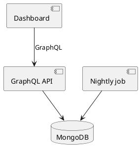
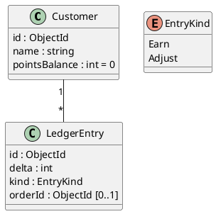
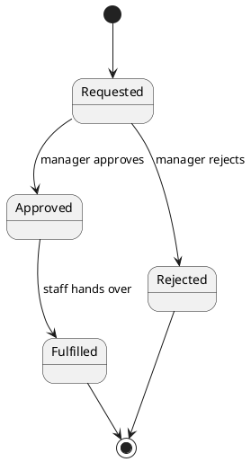

# Design Document Contents

What each part of an architectural design contains, when it appears, and
how to draw its diagram. The same parts, in the same order, are the
design sections you present for approval and the sections of the written
document.

All diagrams are PlantUML. In chat, put them in a ` ```plantuml ` block;
in the document, use the block syntax of its format (see the templates).
In both, colour marks what the design changes — `#LightGreen` new,
`#Yellow` changed, `#Salmon` removed (see Diagram style in SKILL.md).

## The document, in order

| # | Section | Appears | Diagram |
|---|---|---|---|
| 1 | Purpose and scope | always | — |
| 2 | Requirements and terms | always | — |
| 3 | Approach | always | — |
| 4 | UI | when the design has a UI part | — (link to the approved mockup) |
| 5 | Architecture | always | component diagram |
| 6 | Data model | when stored data or shared types are added or changed | class diagram |
| 7 | Flows | always | one sequence diagram per flow |
| 8 | States | when an entity has a status whose transitions are restricted | state diagram per entity |
| 9 | Compatibility and migration | when existing data, or an interface other code depends on, changes | — |
| 10 | Error handling | always | — |
| 11 | Telemetry | when the design crosses a service boundary, adds a background job, or has a failure path someone must diagnose in production | — |
| 12 | Test cases | always | — (see test-cases.md) |

A section whose condition does not hold is left out, not written as
"N/A".

## 1. Purpose and scope

What it is for, who it is for, what is in and what is out.

## 2. Requirements and terms

- **Terms** — each domain word the design uses, defined once. Builders
  working apart use these names, so pick one name per thing.
- **Requirements** — numbered `R-01`, `R-02`, … One testable statement
  each: behavior, permissions (who may see or do what), and limits
  (sizes, rates, timeouts, retention). Test cases cite these IDs.
  When a later section settles another testable behavior — what
  existing data reads as, what a consumer can still rely on — present it
  with a new requirement number in that section, and the document lists
  it here. A new number is the next unused one; a removed number is
  never reused.

## 3. Approach

The chosen approach and why: the alternatives the design principle
(high cohesion, low coupling) ruled out, or, when several survived, why
this one won.

## 4. UI

The approved mockup (its link, or the image saved beside the document)
and each flow it shows, step by step.

## 5. Architecture

The components — services, jobs, stores, UI parts, external systems —
what each is responsible for, and how they connect.



## 6. Data model

Every added or changed entity and shared type: fields with types,
required or optional, defaults, relations, and indexes that carry a rule
(uniqueness, idempotency).



## 7. Flows

Every API flow, data flow and UI flow: requests, messages or data passing
in order between participants. One sequence diagram per flow (see Showing
flows in SKILL.md), with the error or alternate path as `alt` when the
section discusses it.

## 8. States

For each entity with restricted transitions: every state, every allowed
transition with its trigger and who may cause it, and which states are
final.



## 9. Compatibility and migration

What happens to existing data (defaults on read, backfill, or migration)
and to every consumer of a changed interface (API clients, generated
types, other services).

## 10. Error handling

Each failure the design can meet and what happens: what the user sees,
what is retried, what is written or not written.

## 11. Telemetry

Follow the project's existing logging, tracing and metrics conventions.

- **Logs** — each event: name, level, and key fields
- **Traces** — the spans added, and which trace each belongs to; mark
  them on the flows' sequence diagrams
- **Metrics** — each metric: name, type, and labels

## 12. Test cases

The approved UAT, E2E and SIT cases, one line each (see test-cases.md).

## Splitting into several documents

Write one document. When the design covers several subsystems that
builders will read separately, write a master document plus one part
document per subsystem: the master holds sections 1–4 and 12 and pulls
in the parts (AsciiDoc `include::`, Obsidian `![[...]]`); each part holds
sections 5–11 for its subsystem.
