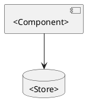
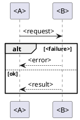

# <Ticket> — <Title>

%% Section order and conditions: design-doc.md. Leave out any section whose condition does not hold. %%

## Purpose and scope

<What it is for, who it is for, what is in, what is out.>

## Requirements and terms

### Terms

- **<Term>** — <definition>

### Requirements

- **R-01** — <one testable statement>
- **R-02** — <one testable statement>

## Approach

<The chosen option and why it beat the alternatives.>

## UI

Approved mockup: [<tool> mockup](<link>)

1. <Flow name>: <step> → <step> → <step>

## Architecture



## Data model

```plantuml
@startuml
class <Entity> {
  <field> : <type>
}
@enduml
```

## Flows

### <Flow name>



## States

### <Entity>

```plantuml
@startuml
[*] --> <State>
<State> --> <State> : <trigger>
@enduml
```

## Compatibility and migration

## Error handling

## Telemetry

### Logs

| Event | Level | Fields |
|---|---|---|
| `<event.name>` | info | <field>, <field> |

### Traces

### Metrics

## Test cases

### UAT

- **TC-01** — As a <role>, when <action>, then <observable result>. (R-01)

### E2E

### SIT

%% Master note of a split design: keep Purpose and scope, Requirements and terms,
Approach, UI and Test cases here, and embed each part note where its sections belong:
![[<part note>]] %%
